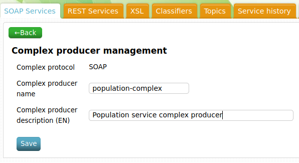
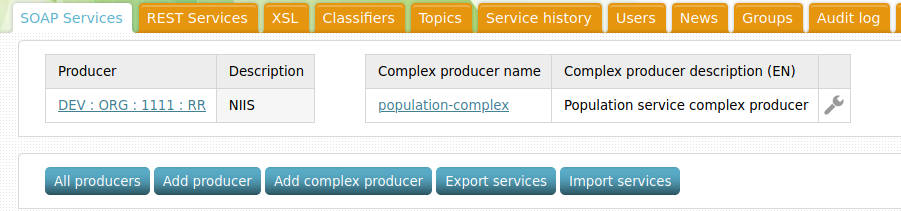
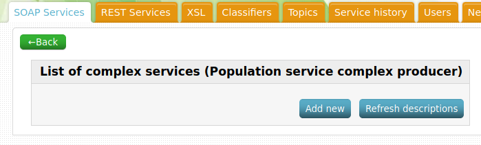
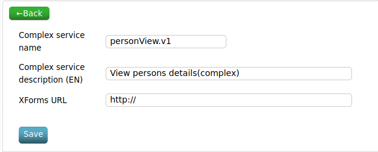
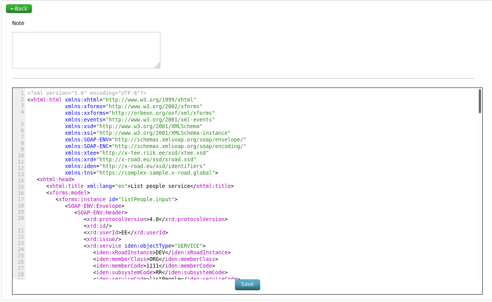
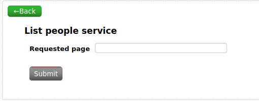
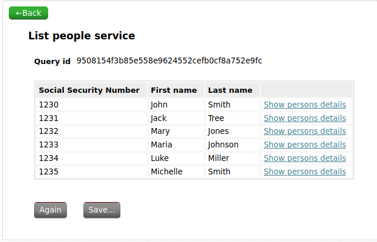
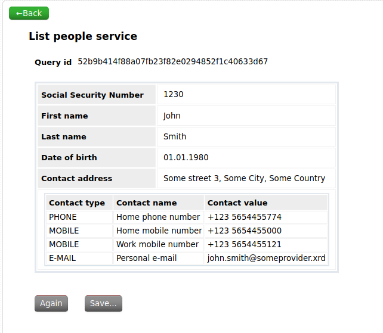

# MISP2 Creating complex queries

Version: 1.0

## Version history <!-- omit in toc -->

 Date       | Version | Description                                                                  | Author
 ---------- | ------- | ---------------------------------------------------------------------------- | --------------------
 01.06.2021 | 1.0     | Convert the original guide in Estonian to English with a new example service | Raido Kaju

## License <!-- omit in toc -->

This document is licensed under the Creative Commons Attribution-ShareAlike 3.0 Unported License.
To view a copy of this license, visit <http://creativecommons.org/licenses/by-sa/3.0/>

## Table of content <!-- omit in toc -->

* [1 Introduction](#1-introduction)
* [2 Simple services](#2-simple-services)
* [3 Complex services in MISP2](#3-complex-services-in-misp2)
  * [3.1 Adding a complex service](#31-adding-a-complex-service)
  * [3.2 Options for developing complex services](#32-options-for-developing-complex-services)
  * [3.3 Developing the service](#33-developing-the-service)
  * [3.4 Creating the link between two services](#34-creating-the-link-between-two-services)
  * [3.5 Removing excessive elements from the response](#35-removing-excessive-elements-from-the-response)
  * [3.6 Result](#36-result)
* [Appendix 1 - Example complex service XForms description](#appendix-1---example-complex-service-xforms-description)

## 1 Introduction

The aim of this document is to give a short overview of how to combine two
simple X-Road queries into a complex query, that can be used in MISP2.

This guide is meant for developers implementing X-Road services in MISP2. The
software uses a framework called `XForms` as a presentation layer for X-Road
queries. `XForms` is a markup language, that was designed to be the next
generation of HTML / XHTML forms.

The reader is expected to have at least a basic knowledge of the semantics of
`XForms`.

## 2 Simple services

We will use two simple queries from the mock
[populationService](./complex-sample.wsdl) when implementing the new complex
service:

* `listPeople.v1` - which returns a list containing peoples social security
  numbers, first and last names, taking the page number as an input
* `personDetails.v1` - which takes a social security number as an input and
  returns more details information about the selected person

Before moving forward with implementing the complex services, be sure that the
simple service forms have already been generated using either the MISP2 web
interface or the `wsdl2xforms` command-line script.

The main purpose of developing a complex service is impementing the connection
between two simple services: we take the output (or a part of the output) form
the first service and use it as an input for the next. The main responsibility
of the developer of these services is to locate the proper places in XForms and
inject additional commands to them to enable this interaction.

## 3 Complex services in MISP2

### 3.1 Adding a complex service

In order to add a complex service, you should first add a complex producer. This
can be done by a user with either the portal manager or service manager group
attached to them. For SOAP services, the button `Add complex producer` is found
under the `SOAP Services` tab in the main view. When you click the button, you
are presented with the following view:



Fill out the name and description fields and click `Save`. Once a complex
producer has been added, it should be visible in the complex producers list:



When clicking on the name of the complex producer, we are presented with a list
of complex services it contains. When adding a new complex producer, this list
will be empty:



Clicking the `Add new` button in this view will take us to a view where we can
add metadata about the new complex service:



Fill out the name and description fields. The `XForms URL` field can be used to
load an existing XForms description. If none is available, it can be left as is.
Please not that the service name must be in the format `serviceName.vX`, where X
represents the version of the service we wish to use. When you click `Save`, the
new service will be added to the list:


### 3.2 Options for developing complex services

There are two options for developing the service. One is to simply click on the
name of the service and use the text area in the web UI to write the XForms
description. The other option is to use your favourite plaintext editor and
simply copy the results to the text area or provide it via a URL.

### 3.3 Developing the service

First, lets copy the XForm description from our simple service `listPeople.v1`
to our complex service `population-complex.personView.v1`:



The resulting document looks like a common file with `XML/HTML` markup, which
contains the `<xforms:modal>` as well as other XForms specific elements. In
short, the file contains the following important top-level sections in order:

1. The file starts with an XML declaration
2. Start the `<xhtml:html>` block, which also includes the definition of all the
   relevant namespace declarations
3. The `<xhtml:head>` block, containing the `<xhtml:title>` element, which
   defines the title of the form. By default, this is generated from the
   `xrd:title` element inside the services annotation from the WSDL.

   The title is followed by a `<xforms:model>` element, which defines the
   following three main things:

    * `<xforms:instance>` - the datastructure
    * `<xforms:bind>` - the validation rules
    * `<xforms:submission>` - the query mapping

4. The `<xhtml:body>` block, which also begins with a title, this time contained
   in an `<xhtml:h1>` element. The title if followed by the short description of
   the service, also inside an `<xhtml:h1>` element. The `<xfroms:switch>`
   element marks the start of the query form.

If we were to save the form without editing anything, we would have the same
simple service that we copied our source from.

To create a complex service, we need to copy the following elements of the
simple service `personDetails.v1` XForms description:

* The all of the following elements should be copied to the `<xforms:model>`
  block of the complex service:
  * `<xforms:instance>` - all except the one where the attribute `id` contains
    the value `temp`, as this would be a duplicate
  * `<xforms:bind>`
  * `<xforms:submission>`
* `<xforms:case id="personDetails.response">` - this needs to be copied to the
  complex services `<xforms:switch>` block

These modifications result in an XForms description that contains the required
elements for running both queries.

### 3.4 Creating the link between two services

Next we need to create a trigger (link) under the `<xforms:repeat
nodeset="person" ...>` element, which can be used to call the next service using
the first services output. This must be created under the `<xforms:case
id="listPeople.response">` block.

Before doing that, we can edit the generated `id` attribute value under the
`<xforms:repeat nodeset="person" ...>` element, which will be used inside the
trigger description. For the purpouses of this example, lets call it the
`person_id`. The results will look like this: `<xforms:repeat nodeset="person"
id="person_id">`.

Next we create the trigger with the following code:

```xml
  <xforms:trigger appearance="minimal">
    <xforms:label xml:lang="en">Show persons details</xforms:label>
    <xforms:setvalue ref="instance('personDetails.input')//ssn" value="instance('listPeople.output')//person[index('person_id')]/ssn" events:event="DOMActivate"/>
    <xforms:send submission="personDetails.submission" events:event="DOMActivate"/>
  </xforms:trigger>
```

The important parts of the trigger are as follows:

* `appearance="minimal"` - this causes the trigger to be rendered as a link
  rather than a button
* `<xforms:label>` - this defines the label that is displayed to the user, note
  that the label must also define which localisation it is for
* `<xforms:setvalue>` - the `ref` attribute defines the destinations `XPath`,
  the `value` attribute indicates the `XPath` to use for getting the value. Note
  that the previously defined index `person_id` is used to find the correct
  person from the list. Both the `ref` and `value` attribute can also specify
  the full path of the location.
* `<xforms:send>` - this sends the SOAP request by finding the matching
  `xforms:submission` element with the specified `id` value
  `personDetails.submission`

### 3.5 Removing excessive elements from the response

To remove any element from the response, just remove the subelement of the
queries response. For example, to remove the `dateOfBirth` element from the
`personDetails.v1` response, find and remove the `<xforms:output
ref="dateOfBirth">` block from under `<xforms:case
id="personDetails.response">`.

### 3.6 Result

The result is a complex service that can be used to query a page of people from
the service, view the list of results, click next to a person and view that
persons details.

Requesting the page of people:



List of people with the added links:



Viewing a persons details



## Appendix 1 - Example complex service XForms description

```xml
<?xml version="1.0" encoding="UTF-8"?>
<xhtml:html xmlns:xhtml="http://www.w3.org/1999/xhtml"
            xmlns:xforms="http://www.w3.org/2002/xforms"
            xmlns:xxforms="http://orbeon.org/oxf/xml/xforms"
            xmlns:events="http://www.w3.org/2001/xml-events"
            xmlns:xsd="http://www.w3.org/2001/XMLSchema"
            xmlns:xsi="http://www.w3.org/2001/XMLSchema-instance"
            xmlns:SOAP-ENV="http://schemas.xmlsoap.org/soap/envelope/"
            xmlns:SOAP-ENC="http://schemas.xmlsoap.org/soap/encoding/"
            xmlns:xtee="http://x-tee.riik.ee/xsd/xtee.xsd"
            xmlns:xrd="http://x-road.eu/xsd/xroad.xsd"
            xmlns:iden="http://x-road.eu/xsd/identifiers"
            xmlns:tns="https://complex-sample.x-road.global">
   <xhtml:head>
      <xhtml:title xml:lang="en">List people service</xhtml:title>
      <xforms:model>
         <xforms:instance id="listPeople.input">
            <SOAP-ENV:Envelope>
               <SOAP-ENV:Header>
                  <xrd:protocolVersion>4.0</xrd:protocolVersion>
                  <xrd:id/>
                  <xrd:userId>EE</xrd:userId>
                  <xrd:issue/>
                  <xrd:service iden:objectType="SERVICE">
                     <iden:xRoadInstance>DEV</iden:xRoadInstance>
                     <iden:memberClass>ORG</iden:memberClass>
                     <iden:memberCode>1111</iden:memberCode>
                     <iden:subsystemCode>RR</iden:subsystemCode>
                     <iden:serviceCode>listPeople</iden:serviceCode>
                     <iden:serviceVersion>v1</iden:serviceVersion>
                  </xrd:service>
                  <xrd:client iden:objectType="SUBSYSTEM">
                     <iden:xRoadInstance>DEV</iden:xRoadInstance>
                     <iden:memberClass/>
                     <iden:memberCode/>
                     <iden:subsystemCode/>
                  </xrd:client>
               </SOAP-ENV:Header>
               <SOAP-ENV:Body>
                  <ns5:listPeople xmlns:ns5="https://complex-sample.x-road.global">
                     <page/>
                  </ns5:listPeople>
               </SOAP-ENV:Body>
            </SOAP-ENV:Envelope>
         </xforms:instance>
         <xforms:instance id="listPeople.output">
            <dummy/>
         </xforms:instance>
         <xforms:bind nodeset="instance('listPeople.input')/SOAP-ENV:Body">
            <xforms:bind nodeset="tns:listPeople">
               <xforms:bind nodeset="page" type="xforms:decimal"/>
            </xforms:bind>
         </xforms:bind>
         <xforms:bind nodeset="instance('listPeople.output')/SOAP-ENV:Body">
            <xforms:bind nodeset="tns:listPeopleResponse">
               <xforms:bind nodeset="people">
                  <xforms:bind nodeset="person">
                     <xforms:bind nodeset="ssn" type="xforms:string"/>
                     <xforms:bind nodeset="firstName" type="xforms:string"/>
                     <xforms:bind nodeset="lastName" type="xforms:string"/>
                  </xforms:bind>
               </xforms:bind>
               <xforms:bind nodeset="fault">
                  <xforms:bind nodeset="faultCode" type="xforms:string"/>
                  <xforms:bind nodeset="faultString" type="xforms:string"/>
               </xforms:bind>
            </xforms:bind>
         </xforms:bind>
         <xforms:submission id="listPeople.submission"
                            action="http://example.org/xroad-endpoint"
                            mediatype="application/soap+xml; charset=UTF-8; action="
                            encoding="UTF-8"
                            ref="instance('listPeople.input')"
                            method="post"
                            replace="instance"
                            instance="listPeople.output">
            <xforms:setvalue ref="instance('temp')/relevant"
                             value="false()"
                             events:event="xforms-submit"/>
            <xforms:setvalue ref="instance('listPeople.input')/SOAP-ENV:Header/*:id"
                             value="digest(string(random()), 'SHA-1', 'hex')"
                             events:event="xforms-submit"/>
            <xforms:toggle case="listPeople.response" events:event="xforms-submit-done"/>
            <xforms:setvalue ref="instance('temp')/relevant"
                             value="true()"
                             events:event="xforms-submit-done"/>
            <xforms:setvalue ref="instance('temp')/relevant"
                             value="true()"
                             events:event="xforms-submit-error"/>
            <xforms:message level="modal" events:event="xforms-submit-error">
               <xforms:output xml:lang="et"
                              value="if (event('error-type') = 'submission-in-progress') then 'Üks päring juba käib!'        else if (event('error-type') = 'no-data') then 'Pole andmeid, mida saata!'        else if (event('error-type') = 'validation-error') then 'Valideerimise viga!'        else if (event('error-type') = 'parse-error') then 'Viga vastuse töötlemisel!'        else if (event('error-type') = 'resource-error') then 'Päringu vastus ei ole XML!'        else if (event('error-type') = 'target-error') then 'Sihtkoha viga!'        else 'Sisemine viga!'"/>
               <xforms:output xml:lang="en"
                              value="if (event('error-type') = 'submission-in-progress') then 'Submission already started!'        else if (event('error-type') = 'no-data') then 'No data to submit!'        else if (event('error-type') = 'validation-error') then 'Validation error!'        else if (event('error-type') = 'parse-error') then 'Error parsing response!'        else if (event('error-type') = 'resource-error') then 'Response is not XML!'        else if (event('error-type') = 'target-error') then 'Target error!'        else 'Internal error!'"/>
            </xforms:message>
         </xforms:submission>
         <xforms:instance id="temp">
            <temp>
               <relevant xsi:type="boolean">true</relevant>
            </temp>
         </xforms:instance>
         <xforms:dispatch targetid="listPeople.request"
                          name="xforms-select"
                          events:event="xforms-ready"/>
        <xforms:instance id="personDetails.input">
            <SOAP-ENV:Envelope>
               <SOAP-ENV:Header>
                  <xrd:protocolVersion>4.0</xrd:protocolVersion>
                  <xrd:id/>
                  <xrd:userId>EE</xrd:userId>
                  <xrd:issue/>
                  <xrd:service iden:objectType="SERVICE">
                     <iden:xRoadInstance>DEV</iden:xRoadInstance>
                     <iden:memberClass>ORG</iden:memberClass>
                     <iden:memberCode>1111</iden:memberCode>
                     <iden:subsystemCode>RR</iden:subsystemCode>
                     <iden:serviceCode>personDetails</iden:serviceCode>
                     <iden:serviceVersion>v1</iden:serviceVersion>
                  </xrd:service>
                  <xrd:client iden:objectType="SUBSYSTEM">
                     <iden:xRoadInstance>DEV</iden:xRoadInstance>
                     <iden:memberClass/>
                     <iden:memberCode/>
                     <iden:subsystemCode/>
                  </xrd:client>
               </SOAP-ENV:Header>
               <SOAP-ENV:Body>
                  <ns5:personDetails xmlns:ns5="https://complex-sample.x-road.global">
                     <ssn/>
                  </ns5:personDetails>
               </SOAP-ENV:Body>
            </SOAP-ENV:Envelope>
         </xforms:instance>
         <xforms:instance id="personDetails.output">
            <dummy/>
         </xforms:instance>
         <xforms:instance id="lookup-w6aab1b1c17b3">
            <lookup>
               <item value="phone">
                  <label xml:lang="en">PHONE</label>
               </item>
               <item value="mobile">
                  <label xml:lang="en">MOBILE</label>
               </item>
               <item value="email">
                  <label xml:lang="en">E-MAIL</label>
               </item>
            </lookup>
         </xforms:instance>
         <xforms:bind nodeset="instance('personDetails.input')/SOAP-ENV:Body">
            <xforms:bind nodeset="tns:personDetails">
               <xforms:bind nodeset="ssn" type="xforms:string"/>
            </xforms:bind>
         </xforms:bind>
         <xforms:bind nodeset="instance('personDetails.output')/SOAP-ENV:Body">
            <xforms:bind nodeset="tns:personDetailsResponse">
               <xforms:bind nodeset="person">
                  <xforms:bind nodeset="ssn" type="xforms:string"/>
                  <xforms:bind nodeset="firstName" type="xforms:string"/>
                  <xforms:bind nodeset="lastName" type="xforms:string"/>
                  <xforms:bind nodeset="dateOfBirth" type="xforms:date"/>
                  <xforms:bind nodeset="contactAddress" type="xforms:string"/>
                  <xforms:bind nodeset="contacts">
                     <xforms:bind nodeset="contact">
                        <xforms:bind nodeset="type" type="xforms:string"/>
                        <xforms:bind nodeset="name" type="xforms:string"/>
                        <xforms:bind nodeset="value" type="xforms:string"/>
                     </xforms:bind>
                  </xforms:bind>
               </xforms:bind>
               <xforms:bind nodeset="fault">
                  <xforms:bind nodeset="faultCode" type="xforms:string"/>
                  <xforms:bind nodeset="faultString" type="xforms:string"/>
               </xforms:bind>
            </xforms:bind>
         </xforms:bind>
        <xforms:submission id="personDetails.submission"
                            action="http://example.org/xroad-endpoint"
                            mediatype="application/soap+xml; charset=UTF-8; action="
                            encoding="UTF-8"
                            ref="instance('personDetails.input')"
                            method="post"
                            replace="instance"
                            instance="personDetails.output">
            <xforms:setvalue ref="instance('temp')/relevant"
                             value="false()"
                             events:event="xforms-submit"/>
            <xforms:setvalue ref="instance('personDetails.input')/SOAP-ENV:Header/*:id"
                             value="digest(string(random()), 'SHA-1', 'hex')"
                             events:event="xforms-submit"/>
            <xforms:toggle case="personDetails.response" events:event="xforms-submit-done"/>
            <xforms:setvalue ref="instance('temp')/relevant"
                             value="true()"
                             events:event="xforms-submit-done"/>
            <xforms:setvalue ref="instance('temp')/relevant"
                             value="true()"
                             events:event="xforms-submit-error"/>
            <xforms:message level="modal" events:event="xforms-submit-error">
               <xforms:output xml:lang="et"
                              value="if (event('error-type') = 'submission-in-progress') then 'Üks päring juba käib!'        else if (event('error-type') = 'no-data') then 'Pole andmeid, mida saata!'        else if (event('error-type') = 'validation-error') then 'Valideerimise viga!'        else if (event('error-type') = 'parse-error') then 'Viga vastuse töötlemisel!'        else if (event('error-type') = 'resource-error') then 'Päringu vastus ei ole XML!'        else if (event('error-type') = 'target-error') then 'Sihtkoha viga!'        else 'Sisemine viga!'"/>
               <xforms:output xml:lang="en"
                              value="if (event('error-type') = 'submission-in-progress') then 'Submission already started!'        else if (event('error-type') = 'no-data') then 'No data to submit!'        else if (event('error-type') = 'validation-error') then 'Validation error!'        else if (event('error-type') = 'parse-error') then 'Error parsing response!'        else if (event('error-type') = 'resource-error') then 'Response is not XML!'        else if (event('error-type') = 'target-error') then 'Target error!'        else 'Internal error!'"/>
            </xforms:message>
         </xforms:submission>
      </xforms:model>
   </xhtml:head>
   <xhtml:body>
      <xhtml:h1 xml:lang="en">List people service</xhtml:h1>
      <xforms:group class="help" xml:lang="et">This service returns a list of people in the registry in pages of 100 people, according to the input page. The caller is expected to provide the page number as an input, starting from 1.</xforms:group>
      <xforms:switch>
         <xforms:case id="listPeople.request">
            <xforms:group ref="instance('listPeople.input')/SOAP-ENV:Body">
               <xforms:group ref="tns:listPeople">
                  <xforms:input ref="page">
                     <xforms:label xml:lang="en">Requested page</xforms:label>
                  </xforms:input>
               </xforms:group>
            </xforms:group>
            <xforms:group class="actions">
               <xforms:submit submission="listPeople.submission">
                  <xforms:label xml:lang="et">Esita päring</xforms:label>
                  <xforms:label xml:lang="en">Submit</xforms:label>
               </xforms:submit>
            </xforms:group>
         </xforms:case>
         <xforms:case id="listPeople.response">
            <xforms:group ref="instance('listPeople.output')/SOAP-ENV:Header" class="serviceid">
               <xforms:output ref="xrd:id">
                  <xforms:label xml:lang="et">Päringu id</xforms:label>
                  <xforms:label xml:lang="en">Query id</xforms:label>
               </xforms:output>
            </xforms:group>
            <xforms:group ref="instance('listPeople.output')/SOAP-ENV:Body">
               <xforms:group ref="tns:listPeopleResponse">
                  <xforms:group ref="people">
                     <xforms:repeat nodeset="person" id="person_id">
                        <xforms:output ref="ssn">
                           <xforms:label xml:lang="en">Social Security Number</xforms:label>
                        </xforms:output>
                        <xforms:output ref="firstName">
                           <xforms:label xml:lang="en">First name</xforms:label>
                        </xforms:output>
                        <xforms:output ref="lastName">
                           <xforms:label xml:lang="en">Last name</xforms:label>
                        </xforms:output>
                       <xforms:trigger appearance="minimal">
                         <xforms:label xml:lang="en">Show persons details</xforms:label>
                         <xforms:setvalue ref="instance('personDetails.input')//ssn" value="instance('listPeople.output')//person[index('person_id')]/ssn" events:event="DOMActivate"/>
                         <xforms:send submission="personDetails.submission" events:event="DOMActivate"/>
                       </xforms:trigger>
                     </xforms:repeat>
                  </xforms:group>
                  <xforms:group ref="fault">
                     <xforms:output ref="faultCode">
                        <xforms:label xml:lang="en">Fault Code</xforms:label>
                     </xforms:output>
                     <xforms:output ref="faultString">
                        <xforms:label xml:lang="en">Fault explanation</xforms:label>
                     </xforms:output>
                  </xforms:group>
               </xforms:group>
            </xforms:group>
            <xforms:group ref="instance('listPeople.output')/SOAP-ENV:Body/tns:listPeopleResponse[if (keha) then not(keha/*) else if (response) then not(response/*) else not(*)]"
                          class="info">
               <xhtml:span xml:lang="et">Andmeid ei tulnud.</xhtml:span>
               <xhtml:span xml:lang="en">Service returned no data.</xhtml:span>
            </xforms:group>
            <xforms:group ref="instance('listPeople.output')/SOAP-ENV:Body/SOAP-ENV:Fault"
                          class="fault">
               <xforms:output ref="faultstring"/>
            </xforms:group>
            <xforms:group class="actions">
               <xforms:trigger>
                  <xforms:label xml:lang="et">Uuesti</xforms:label>
                  <xforms:label xml:lang="en">Again</xforms:label>
                  <xforms:toggle events:event="DOMActivate" case="listPeople.request"/>
               </xforms:trigger>
            </xforms:group>
         </xforms:case>
        <xforms:case id="personDetails.response">
            <xforms:group ref="instance('personDetails.output')/SOAP-ENV:Header"
                          class="serviceid">
               <xforms:output ref="xrd:id">
                  <xforms:label xml:lang="et">Päringu id</xforms:label>
                  <xforms:label xml:lang="en">Query id</xforms:label>
               </xforms:output>
            </xforms:group>
            <xforms:group ref="instance('personDetails.output')/SOAP-ENV:Body">
               <xforms:group ref="tns:personDetailsResponse">
                  <xforms:group ref="person">
                     <xforms:output ref="ssn">
                        <xforms:label xml:lang="en">Social Security Number</xforms:label>
                     </xforms:output>
                     <xforms:output ref="firstName">
                        <xforms:label xml:lang="en">First name</xforms:label>
                     </xforms:output>
                     <xforms:output ref="lastName">
                        <xforms:label xml:lang="en">Last name</xforms:label>
                     </xforms:output>
                     <xforms:output ref="dateOfBirth">
                        <xforms:label xml:lang="en">Date of birth</xforms:label>
                     </xforms:output>
                     <xforms:output ref="contactAddress">
                        <xforms:label xml:lang="en">Contact address</xforms:label>
                     </xforms:output>
                     <xforms:group ref="contacts">
                        <xforms:repeat nodeset="contact"
                                       id="personDetails_output_tns_personDetailsResponse_person_contacts_contact">
                           <xforms:group ref="type">
                              <xforms:label xml:lang="en">Contact type</xforms:label>
                              <xforms:output value="instance('lookup-w6aab1b1c17b3')/item[@value = current()]/label"/>
                           </xforms:group>
                           <xforms:output ref="name">
                              <xforms:label xml:lang="en">Contact name</xforms:label>
                           </xforms:output>
                           <xforms:output ref="value">
                              <xforms:label xml:lang="en">Contact value</xforms:label>
                           </xforms:output>
                        </xforms:repeat>
                     </xforms:group>
                  </xforms:group>
                  <xforms:group ref="fault">
                     <xforms:output ref="faultCode">
                        <xforms:label xml:lang="en">Fault Code</xforms:label>
                     </xforms:output>
                     <xforms:output ref="faultString">
                        <xforms:label xml:lang="en">Fault explanation</xforms:label>
                     </xforms:output>
                  </xforms:group>
               </xforms:group>
            </xforms:group>
            <xforms:group ref="instance('personDetails.output')/SOAP-ENV:Body/tns:personDetailsResponse[if (keha) then not(keha/*) else if (response) then not(response/*) else not(*)]"
                          class="info">
               <xhtml:span xml:lang="et">Andmeid ei tulnud.</xhtml:span>
               <xhtml:span xml:lang="en">Service returned no data.</xhtml:span>
            </xforms:group>
            <xforms:group ref="instance('personDetails.output')/SOAP-ENV:Body/SOAP-ENV:Fault"
                          class="fault">
               <xforms:output ref="faultstring"/>
            </xforms:group>
            <xforms:group class="actions">
               <xforms:trigger>
                  <xforms:label xml:lang="et">Uuesti</xforms:label>
                  <xforms:label xml:lang="en">Again</xforms:label>
                  <xforms:toggle events:event="DOMActivate" case="personDetails.request"/>
               </xforms:trigger>
            </xforms:group>
         </xforms:case>
      </xforms:switch>
   </xhtml:body>
</xhtml:html>
```
