|  |
| -------------------------: |

# MISP2 Manager Guide

Version: 2.1

## Version history <!-- omit in toc -->

 Date       | Version | Description                                                     | Author
 ---------- | ------- | --------------------------------------------------------------- | --------------------
 25.05.2021 | 2.1     | Convert from Word to Markdown                                   | Raido Kaju

## License <!-- omit in toc -->

This document is licensed under the Creative Commons Attribution-ShareAlike 3.0 Unported License.
To view a copy of this license, visit <http://creativecommons.org/licenses/by-sa/3.0/>

## Table of content <!-- omit in toc -->

* [1 Introduction](#1-introduction)
  * [1.1 X-Road](#11-x-road)
  * [1.2 MISP2 application](#12-misp2-application)
    * [1.2.1 Portal types](#121-portal-types)
    * [1.2.2 User roles](#122-user-roles)
  * [1.3 System requirements](#13-system-requirements)
    * [1.3.1 Browser](#131-browser)
* [2 General information](#2-general-information)
* [3 Service manager](#3-service-manager)
  * [3.1 E-service management](#31-e-service-management)
    * [3.1.1 Refreshing X-Road producers list](#311-refreshing-x-road-producers-list)
    * [3.1.2 Refreshing organisation’s allowed services](#312-refreshing-organisations-allowed-services)
    * [3.1.3 XForms descriptions update (addition or modification)](#313-xforms-descriptions-update-addition-or-modification)
    * [3.1.4 Generating XForms description from WSDL](#314-generating-xforms-description-from-wsdl)
    * [3.1.5 Viewing XForms description](#315-viewing-xforms-description)
  * [3.2 Active and complex producers and their services export/import](#32-active-and-complex-producers-and-their-services-exportimport)
    * [3.2.1 Export](#321-export)
    * [3.2.2 Import](#322-import)
  * [3.3 XSL stylesheets management](#33-xsl-stylesheets-management)
    * [3.3.1 Adding an XSL stylesheet](#331-adding-an-xsl-stylesheet)
    * [3.3.2 XSL style sheets changing (viewing)](#332-xsl-style-sheets-changing-viewing)
    * [3.3.3 XSL style sheet deleting](#333-xsl-style-sheet-deleting)
* [4 Permission manager](#4-permission-manager)
  * [4.1 User groups and query rights management](#41-user-groups-and-query-rights-management)
    * [4.1.1 Creating user group](#411-creating-user-group)
    * [4.1.2 Changing user group](#412-changing-user-group)
    * [4.1.3 Removing user group](#413-removing-user-group)
    * [4.1.4 Viewing and changing groups’ query permissions](#414-viewing-and-changing-groups-query-permissions)
    * [4.1.5 Hiding allowed queries from the user](#415-hiding-allowed-queries-from-the-user)
    * [4.1.6 Removing permission rights from group](#416-removing-permission-rights-from-group)
    * [4.1.7 Viewing user groups’ members and adding/removing users to/from a group](#417-viewing-user-groups-members-and-addingremoving-users-tofrom-a-group)
  * [4.2 User account management](#42-user-account-management)
    * [4.2.1 Adding a new user account](#421-adding-a-new-user-account)
    * [4.2.2 User account changing](#422-user-account-changing)
    * [4.2.3 User account deletion](#423-user-account-deletion)
* [5 Portal mangers](#5-portal-mangers)
  * [5.1 Service management](#51-service-management)
  * [5.2 XSL stylesheet management](#52-xsl-stylesheet-management)
  * [5.3 User groups management](#53-user-groups-management)
  * [5.4 Topics](#54-topics)
  * [5.5 Classifiers management](#55-classifiers-management)
  * [5.6 Viewing service history](#56-viewing-service-history)
  * [5.7 Units management](#57-units-management)
    * [5.7.1 View and search units](#571-view-and-search-units)
    * [5.7.2 Adding a new unit](#572-adding-a-new-unit)
    * [5.7.3 Changing units](#573-changing-units)
    * [5.7.4 Removing units](#574-removing-units)
  * [5.8 Audit log](#58-audit-log)
  * [5.9 Export/Import](#59-exportimport)
    * [5.9.1 Selectable data sets](#591-selectable-data-sets)
    * [5.9.2 Export](#592-export)
    * [5.9.3 Import](#593-import)

## 1 Introduction

This document describes the use and management of MISP2 application. The
structure of the document is divided according to user roles, each describing
this role’s actions.

### 1.1 X-Road

[X-Road®](https://x-road.global/) is open-source software and ecosystem solution
that provides unified and secure data exchange between organisations.

The following figure describes X-Road infrastructure:

The basic idea of X-Road is that members of an ecosystem exchange data through
access points (Security Servers) that implement the same technical
specifications.

### 1.2 MISP2 application

MISP2 (Mini-Information System Portal) is an application that provides an easy
way to query data over X-Road. Its easy-to-use web-based user interface provides
a unified way to access different services.

#### 1.2.1 Portal types

One can create and use four different types of portals In MISP2 application.
This paragraph describes their main aspects and differences towards others.

The portal types are:

* Information system of organization.
  * One consumer organization is bound to the portal.
  * User can only use e-services on behalf of the bound organization. User must
    also have user role and query permissions given by this organization.
  * Services of X-Road producers are opened to the bound organization.
* Citizen portal
  * Citizen portal is a portal for public e-services.
  * Organization portal’s special case where public user group is used. All
    authenticated users are considered to be in public user group.
  * User account is not required to enter the portal and use e-services.
  * Authenticated user may use all e-services which are opened in portal.
* Universal portal
  * Only one organization is bound to portal (organization managing the portal).
  * There is used a concept of unit. User roles and user permissions are bound
    to the portal unit. These roles and permissions are valid only under the
    bound unit. For example in family physician portal the portal unit is a
    doctor.
  * E-services can only be used as a unit’s representative, meaning
    querypermissions and user role are required under the unit.
  * To use the portal, a new unit has to be registered by the representative
    person, whose representation rights are checked using X-Road producers
    standard representation rights query.
  * Under portal’s organization rights (while not representing any unit) only
    meta-services are executed.
  * Services of X-Road producers are opened (depending of portal configuration):
    * To the bound organization.
    * To the portal unit organization
* Business portal
  * Special case of universal portal, where units are registered in the Business
    Register.
  * During unit registration, check query is sent to CCR. The response may
    include businesses with single or unknown representation rights. Unknown
    representation rights mean that additional confirmations are required from
    other unit’s representatives to set units permissions managers.

#### 1.2.2 User roles

The following user roles are used in MISP2 (roles in bold are thoroughly
described in this document):

* Service manager
  * Manages metadata of e-services used in portal (refreshes query lists,
    service user interfaces and XSL stylesheets)
* Portal administrator (Application administrator)
  * Adds new portal and configures all required parameters (incl. portal
    managers setting).
* Portal manager
  * Manages metadata of e-services used in portal (refreshes query lists,
    service user interfaces and producer classifiers).
  * In the case of organization information system:
  * Manages portals query rights, user accounts and groups.
* Portal manager (universal portal)
  * Manages portals global user groups and their query rights.
* Permission manager
  * Manages user groups and accounts of the unit.
  * Manages user’s e-service query rights of the unit.
* Registrar (universal portal)
  * Registers new units if allowed in the portal configuration. This role is
    automatically assigned to all portal users when it is allowed in portal
    configuration.
* Representative person (universal portal)
  * Registers new units.
  * Manages permission manager accounts of the unit.
  * In case of simplified permission management, manages user’s e-service query
    rights of the unit.
* E-service user
  * Uses e-services open to their user group in the portal.
  * Uses public e-services in the portal.

### 1.3 System requirements

#### 1.3.1 Browser

The portal is available in the recent versions of popular browsers (Internet
Explorer, Firefox, Google Chrome).

To use this portal, following options have to be enabled in your browser:

* Session cookies
* JavaScript

See your browsers manual how to enable them.

## 2 General information

For general information about portal functionality please refer to the
documentation “MISP2 user guide”.

## 3 Service manager

### 3.1 E-service management

Only developers and portal managers are allowed to manage e-services. To manage
e-service, select the tab “Services” from the menu and you will be provided with
a list of producers saved in the portal. Complex producers are listed on the
right, active X-Road producers on the left.

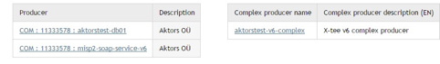

In X-Road version 6, producers are identified by three fields: member class,
member code and subsystem code. In the current system producer list, all these
fields are separated by colon (see “Producer” column of the image above).

#### 3.1.1 Refreshing X-Road producers list

To refresh the producers list, click on the `All producers` button and then
click on the button `Refresh producers`. A meta-query is sent to the secure
server to access the X-Road producers list. In X-Road version 6, producers and
consumers are not distinguished, they are all considered clients and displayed
together in the producers list. The user has to be able to select the correct
producer. To simplify finding a relevant producer from the list of clients,
`Search criteria` text field is added. It allows to type in a search term.
Displayed entries are eliminated according to the search word after every
keyboard key press in the `Search criteria` text box. X-Road member class,
member code and subsystem code can be used as search criteria, as well as the
words in description column.

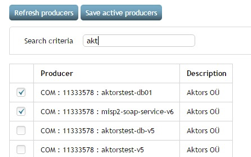

The producer name column format is the same as described in chapter [3.1
E-service management](#31-e-service-management).

In order to add a producer to the system, select the desired producer’s checkbox
and it will be added immediately to the producers list.

#### 3.1.2 Refreshing organisation’s allowed services

Refreshing a query list is done on the producer’s form it belongs to. To get the
list of the producers see the beginning of paragraph
[3.1.1](#311-refreshing-x-road-producers-list).

After selecting a producer by clicking on the link in producer table `Producer`
column, user is directed to the producer’s list of services. After adding a new
producer, the list is empty. It can be populated by clicking on `From Security
Server (allowed)` button. The system then queries the list of allowed services
to current client from Security Server and displays it as shown below.

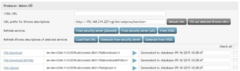

The system also downloads WSDL descriptions for each service to extract
human-readable service names from them. Those names are displayed in the first
column of service list. The  X-Road identifier consisting of X-Road instance,
member class, member code, subsystem code, service name and service version (all
separated with a colon), are displayed in the second column.

Alternatively, button `From Security Server (all)` or `From WSDL` buttons can be
used. The first one behaves similarly to `From Security Server (allowed)`
button, except it uses listMethods meta-service instead of allowedMethods
meta-service to retrieve the list of services from Security Server. `From WSDL`
button is only visible in developer mode and enables to refresh services from
WSDL file URL in `WSDL URL` text field.

The recommended way to refresh services is to use `From Security Server
(allowed)` button.

When refreshing the list of services, if services are found, which previously
were in the list, are missing in the new list acquired from either the Security
Server or WSDL, the option to remove these missing services is presented:

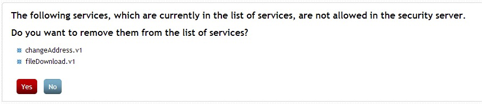

If `Yes` is chosen, the services are removed, including their XForms
descriptions, XSLs (which are applied specifically to the service being
removed), query permissions and everything else linked to the services, except
for entries in the service history.

#### 3.1.3 XForms descriptions update (addition or modification)

In order to design an e-service input/output form in MISP2 the XForms standard
has been introduced. Consequently every e-service must have an input/output
XForms description, which describes that specific forms user interface and data
structure (SOAP queries). MISP2 application uses Orbeon XForms engine. You can
load the XForms description into the portal from the internet or create a new
one using XForms generator in MISP2 portal. XForms generator takes producers
WSDL description as an input. Producers WSDL descriptions are accessible through
X-Road from the corresponding producer. XForms generated by the generator are
saved to MISP2 database automatically.

In order to update XForms go to the producers open service list form (see
above). Select the services you wish to update by checking the box on their
right and enter the URLs to the places where the XForms descriptions are
located. If the above is done, press the button `Load from URL` and the system
will load XForms descriptions from the given URL and save it to the database.
You will be notified about the success or failure of the saving process.

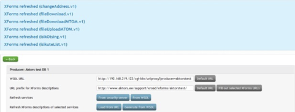

#### 3.1.4 Generating XForms description from WSDL

It is possible to generate XForms description using producer’s WSDL description.

In X-Road version 6, every service may have a different WSDL associated with it.
That is the reason why `Generate from WSDL` button alone is not sufficient to
correctly generate XForms descriptions for multiple services. To generate
services from the associated WSDL-s, the `Generate from Security Server` button
has been added. It downloads WSDL-s for each service from Security Server and
generates XForms descriptions from them.

When using the `Generate from WSDL` button, select the desired queries and then
click the button `Generate from WSDL`. The system will request the producer’s
WSDL and generate XForms description according to it. The resulting XForms is
then saved to the database and URL row will be set to `Generated to database`,
in order to mark its existence.

#### 3.1.5 Viewing XForms description

To view XForms descriptions first go to the producers open services list form
(see above).

By clicking on the query name the system will display the XForms description
form, which contains XForms description of the service and short note that is
shown to user as a quick tip during form execution:

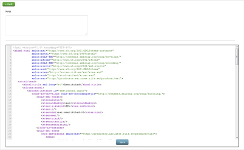

You can change XForms description and note description and save the changes
made. Clicking on the `Back` button bring you to the list of this producer’s
services.

### 3.2 Active and complex producers and their services export/import

#### 3.2.1 Export

Open tab `Services` and click on button `Export services`. Choose appropriate
active and complex producers wholly or only some of their services and click on
button `Export chosen services`.

Then an opportunity arises to download file in zip format, which contains all
the chosen services XForms and also information about those services and their
corresponding active and complex producers.

#### 3.2.2 Import

Open tab `Services` and click on button `Import services`. Click on button
`Browse` and from opened file dialog choose file in zip format to which services
are exported. Click on button `Upload zip file with services`.

Then a chosen zip file with services is uploaded to the server and user is
represented with an opportunity to choose from those services which services
exactly will be imported. For chosen services their XForms and information about
them will be imported and their corresponding active and complex producers will
be added or updated.

For each service it is reported whether it already exists in database. If it
exists, then when it is imported, it will be updated. If it does not exist, then
it will be added on import.

### 3.3 XSL stylesheets management

XSL style sheets can be used to introduce miscellaneous changes and additions to
the services’ XForms form, e.g. adding a `debug` button to the form for SOAP
XML. Stylesheets can be either global (applicable to all producers’ services) or
service based (add information to XForms description for given service). Only
portal managers and developers can manage XSL style sheets. In order to manage a
style sheet select `XSL` from the menu after which system will display style
sheet’s filtering form where you can search required style sheets.

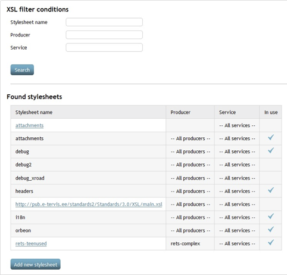

#### 3.3.1 Adding an XSL stylesheet

You can add new style sheets by clicking the button `Add new stylesheet` for
more details see next paragraph.

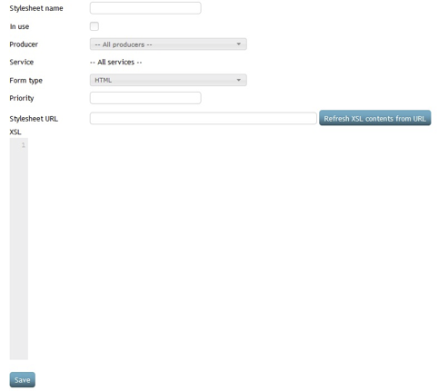

Fill in the following parameters (* marks fields that are required).

* **Name** (*) – name of the style sheet. It is recommended that it describes
  the intended purpose of the style sheet.
* **In use** – shows, if the style sheet is in use
* **Producer** – name of the producer, which can use this style sheet. All
  producers are selected by default.
* **Service** – name of the service, where this style sheet is used. A producer
  must be selected in order to choose services. All services are selected by
  default.
* **Form type** – shows, if this style sheet is applied on XForms (HTML) or PDF
  (used to save service results as PDF file).
* **Priority** – style sheets are applied in a specific order. Priority is used
  to mark importance over other style sheets. If two or more style sheets have
  the same or no priority, then they are applied using the style sheets name.
* **Stylesheet URL** (*) – an address, where style sheets contents are located.
  After entering the address, the contents of the XSL file can be loaded into
  the text area named `XSL` using the button `Refresh XSL contents from URL`.
  Before the contents are actually inserted to the field, it is validated and if
  everything is ok it is loaded, if any errors arise, the error message is shown
  instead.

After you have inserted all required parameters, you can save the data by
clicking the button `Save`, after which a new stylesheet will be added to the
system or error messages are displayed.

#### 3.3.2 XSL style sheets changing (viewing)

In order to change/view a style sheet use XSL filter form to find required XSL
style sheet. You can view/change a stylesheet by clicking on its name in the
search results. After applying all changes, you can save them by clicking the
button `Save`.

XSL contents are loaded automatically on the XSL style sheet form, meaning there
is no need to click the `Refresh XSL contents from URL` button. If the user
inserts style sheets data, including style sheet URL and presses the button
`Save`, the system will load the Xsl description from the given URL and saves
all the data to database. If XST contents have been changed but URL is left
untouched and button `Refresh…` is not specifically pressed, then XSL content is
saved using the value of the text area instead the original from the URL
preserving users’ changes made to the Xsl.

#### 3.3.3 XSL style sheet deleting

To delete a stylesheet, open the Xsl changing form (see above) and press the
`Delete` button.

## 4 Permission manager

### 4.1 User groups and query rights management

In this chapter we are going to look into user groups’ management – adding,
deleting and changing. User groups can be managed only by portal managers and
permission managers. In order to manage a user group select `Groups` from the
main menu after which the system will display a list with all user groups:

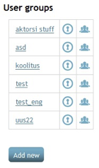

In case of universal and organization portal where only one organization is
bound to the portal (organization managing the portal) and units can be bound to
it, it is possible to manage groups globally and locally. Globally managed
groups are managed in organizations rights and they are visible to all units
using the portal. Global groups’ query rights can only be set in a user role
bound to the organization. Every unit can manage global groups’ members
separately without any collision with other units. Unit’s managed groups are
groups which are defined in the unit’s scope. Group management in the unit’s
scope means that the user doing the management has to be in a role bound to that
unit. Unit’s groups and their query rights are not visible to other units or the
organization.

#### 4.1.1 Creating user group

In order to create a user group, press the button `Add new`, after which an
input form will be displayed:

Group name is the only and mandatory field that has to be filled when creating a
new group. Group name must be unique in the unit. After creating the new group
you will be redirected to group list page.

#### 4.1.2 Changing user group

In order to change user group select the group you want to change from the group
list by clicking on its name. Then the system will display the groups’
management form where you can change the groups’ name. Group name has to be
unique in the unit’s scope.

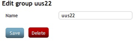

#### 4.1.3 Removing user group

To remove user group go to the user group management form (see above) where you
can press the button `Delete`. When pressed you will be asked for confirmation
and once confirmed the group will be deleted. If you refuse the group will not
be deleted.

#### 4.1.4 Viewing and changing groups’ query permissions

To add query permissions to a group, select the tab `Groups` from the menu,
after which the system will display group list. Choose the group whose query
permissions you want to change/view and click on the button
 on that groups’ row. System will
display that group’s query rights in the currently active unit.

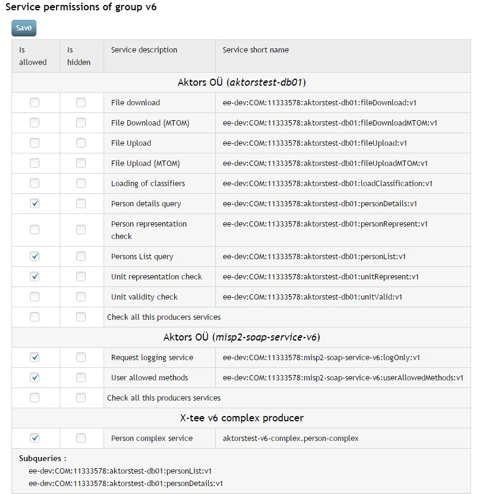

The service short name column consists of the X-Road instance, member class,
member code, subsystem code, service code and service version fields separated
by a colon. Producer name is followed by subsystem code in parentheses.

In this query list, you can select checkboxes in `Is allowed` column to allow
execution of that specific query in a given groups’ rights. Groups of queries
can be hidden and shown. After selecting all desired queries press the button
`Save` to save changes.

**In the case of universal or organization portal**: Since you can’t change
global groups’ permission rights in the scope of the unit, you can only view
groups’ query permission rights (tick denotes checked and empty field denotes
unchecked):

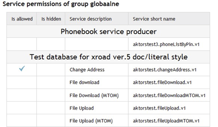

#### 4.1.5 Hiding allowed queries from the user

The aim of hiding open queries from the user is to hide queries which are used
by complex queries. To hide queries navigate to the groups’ permission
management form (see above) and check the checkbox in the column `Is hidden` in
the desired rows of the queries and press `Save`.

#### 4.1.6 Removing permission rights from group

Removing permission rights is basically same as setting them (see
[4.1.4](#414-viewing-and-changing-groups-query-permissions)) except when
removing permission rights you should uncheck the box instead of checking it.

#### 4.1.7 Viewing user groups’ members and adding/removing users to/from a group

Firstly navigate to the user groups’ management form. Then select group and
click on the button  in
its row, after which the system will display all the users in a list. You can
add or remove users from a group by checking or un-checking the checkbox next to
the user’s name.

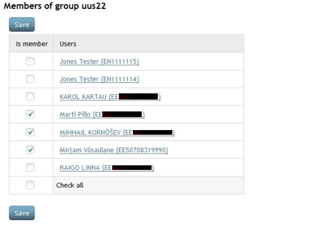

### 4.2 User account management

Portal managers and permission managers can manage user accounts. To manage user
accounts select the tab `Users`, after which the system will display a form to
search users and a button to add new users:

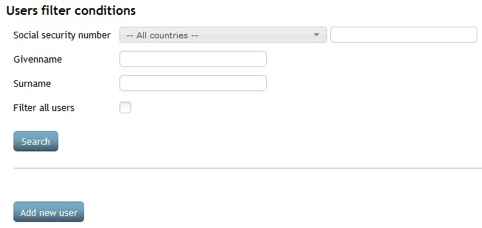

#### 4.2.1 Adding a new user account

To add a new user account press the button `Add new user`, thereupon you will be
redirected to user account’s form

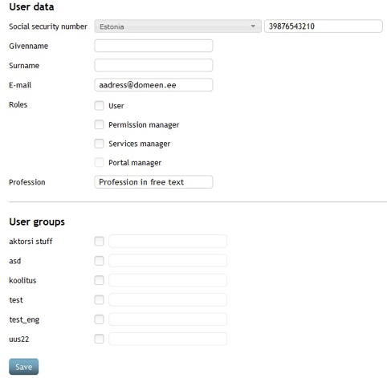

* **Social security number** - user's social security number when Estonia is
  defined as the installation country. In this case, the value is validated and
  it must be a valid Estonian social security number. In case of any other
  country, this field can be considered as a username and any string can be
  used. In both cases, the value has to be unique in the entire portal.
* **Given name** – user’s given name
* **Surname** – user’s surname
* **E-mail** – e-mail address, which is used to notify user about changes made
  to their account. E-mail is bound to the active unit and is not global in the
  portal; it should satisfy common e-mail rules (can’t contain illegal
  characters etc).
* **Roles** – user’s role in the active unit. One user can have 0 to many roles;
  if no roles given, then no binding is done with the active unit. Since group
  affiliation and profession are bound with the active unit as well, neither is
  saved if no role selected. If you are not in the portal manager’s role you
  can’t set others or yourself as portal manager. For more information about
  roles see the respective chapter in this document.
* **Profession** – profession is freely chosen „position” for the user, which
  he/she fills in the unit. Profession could be for instance „developer” or
  „doctor”.
* **User groups** – user groups are groups which are visible in the unit. You
  can manage groups affiliation here or in the group’s management (see Error!
  Reference source not found.) where you can add multiple users at once.
  * Deadline determines when user’s group affiliation ends. After the deadline
    has passed the user can no longer see or execute queries set to that group.
    You can select a deadline using calendar widget. 

Also, for users with certificates you can generate passcode, that will conclude
their authorization in the portal.

Once the form has been filled press `Save`, which binds the user with active
unit and saves all the information entered into database, gives group permission
rights and roles. If any errors occurred with concrete field, the label of that
field will turn red and when hovering over it with your mouse, you can see the
error message.

#### 4.2.2 User account changing

To change a user account you firstly need to find the user you want to change,
using user search form. Once you have found the user, you can open the user
management form by clicking on the user’s name, after which the system will
display the user’s data in form which was described in chapter
[4.2.1](#421-adding-a-new-user-account). The main difference between user
addition and changing is the fact that when changing the user, you can’t change
his/her id-code or country.

#### 4.2.3 User account deletion

There are two ways to delete a user account. First of the two is done in portal
administration mode using the button `Delete`. The other method is using the
user’s management form and pressing button `Delete` on it after which the system
will ask for your confirmation and once given it will try to delete the selected
user from the portal.

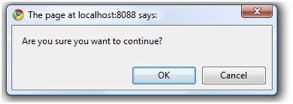

However, if the user has query rights under the unit, you will be asked for
additional confirmation.

Once you have confirmed the action, the user will be deleted. In case of the
user has query rights in any other unit, you are not allowed to delete that user
until all the query rights are removed.

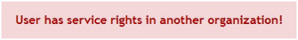

## 5 Portal mangers

### 5.1 Service management

The same as [3.1](#31-e-service-management).

### 5.2 XSL stylesheet management

The same as
[3.2](#32-active-and-complex-producers-and-their-services-exportimport).

### 5.3 User groups management

The same as [4.1](#41-user-groups-and-query-rights-management).

### 5.4 Topics

If portal settings allow usage of topics, queries are grouped according to
topics rather than producers. If it is not allowed then no topics are used and
queries are grouped according to producers.

Topics management enables basic CRUD functionality for topics and a way to
manage which queries belong to which topic. Topic can be empty, meaning it can
have no queries bound to it, in that case that topic isn’t in use. Topic
management can be done only by portal managers.

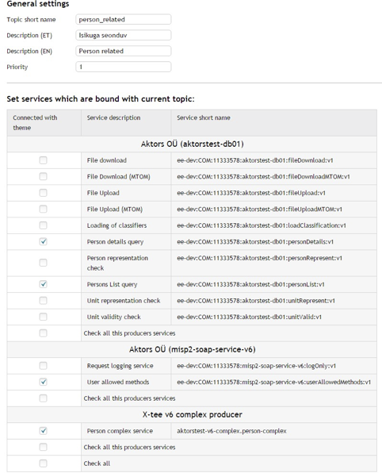

The service short name column consists of the X-Road instance, member class,
member code, subsystem code, service code and service version fields separated
by a colon. Producer name is followed by subsystem code in parentheses.

In case of the topic shown on the screenshot above, grouping of queries is done
in the following way:

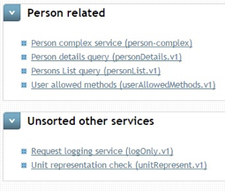

`Unsorted other services` tab consists of services that do not belong to any
topic, but are enabled under group rights. Each link displays service
description followed by its technical name in parentheses. The latter consists
of service operation name in WSDL and service version separated by a dot.

### 5.5 Classifiers management

Classifiers can be managed by portal managers. MISP2 application requires at
least 1 classifier for each language used. That classifier is country names and
codes classifier. Without it, it is not possible to create or search users,
since both these forms use those classifiers. Pressing on the classifier’s name
shows you the content of that classifier as XML. In order to reload a
classifier, click on the name of the desired classifier.

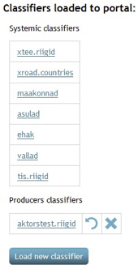

The button `Load new classifier` allows you to load classifiers from producers.

### 5.6 Viewing service history

To view service history of all portal users select the tab `Service history`.
The system will display the service history filter with the following fields:
`Between` `Service name` and `User`.

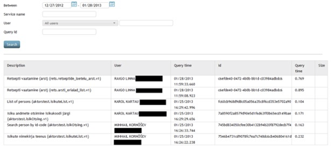

When the form is displayed, service history of the last month are automatically
searched and displayed in a table.

### 5.7 Units management

Units management allows portal manager to add new portal units and to remove or
modify existing units.

#### 5.7.1 View and search units

To find units registered in the portal you have to select the tab `units`, which
will display the unit search form with the input fields for unit name and
registration code. When entering one of these parameters, the units are searched
and displayed in a list. When opening the search form, automatically all the
units are displayed in the result list.

#### 5.7.2 Adding a new unit

New units can be added in portal manually. For this click on button `Add new
unit` which opens the form where you can add data for the new unit. The name and
registration code are required fields, and the registration code can not be
changed after adding the new unit.

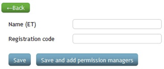

For saving data there are two options. `Save` button saves only the data of the
new unit. And the button `Save and add permission managers` saves the data and
forwards user to the page where you can manage access rights and you are
assigned you automatically the role of representative of this unit.About
managing unit’s access rights see the topic [4](#4-permission-manager).
`Representative person` in MISP2 Guide for Business portal.

#### 5.7.3 Changing units

To change units, click on the appropriate name, which opens the same form as
when adding a new unit, only now it is filled with unit data. Registration code
can not be changed, this should be done by removing the existing unit and adding
a new one.

#### 5.7.4 Removing units

To remove the unit from the portal you must go to the same for form as changing
the unit data, and click on the `delete` button. This removes the unit and also
all its relationships to other objects from the database.

### 5.8 Audit log

These logs are system logs; they represent actions made by users. These logs are
only viewable to portal managers and are saved by meta-service that should be
configured in the portal. By clicking the tab `Managers logs` on main menu you
are shown a form with 1 select box from where you can select the type of log you
want to see:

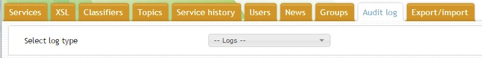

Once you have selected the type of a log you want to view, you are given an
input form, which varies according to the log type. This form is used to filter
logs. Once filled with desired parameters (empty fields are left out) and
`Search` button pressed, the system will find and display filtered logs
according to the parameters you set. For example, for `Logs of check query with
negative answer` the search form looks like:

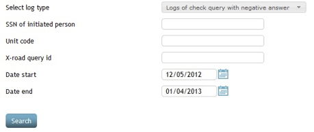

The table below describes all log actions in MISP2.

|**Action name**|**Log type name in filter**|**Description**|**User role**|
|---------------|---------------------------|---------------|-------------|
|**Manager added**|Logs of managers actions|Adding permission manger or portal manager role to user|Portal manager|
|**Manager deleted**|Logs of managers actions|Removing permission manger or portal manager role from user.|Portal manager|
|**Group added**|Logs of groups actions|Adding new user group to portal|Portal manager, permisssion manager|
|**Group removed**|Logs of groups actions|Removing a user group from portal|Portal manager, permisssion manager|
|**Person added to group**|Logs of group person actions|User is added to a user group|Portal manager, permisssion manager|
|**Person removed from group**|Logs of group person actions|User is removed from a user group|Portal manager, permisssion manager|
|**Permission added**|Logs of group permission actions|Adding service permission to user group|Portal manager, permisssion manager|
|**Permission removed**|Logs of group permission actions|Removing service permission from user group|Portal manager, permisssion manager|
|**Person added**|Logs of person actions|New user account was added to portal|Portal manager, permisssion manager|
|**Person removed**|Logs of person actions|User account was deleted from portal|Portal manager, permisssion manager,administrator|
|**Org added**|Logs of portal/org actions|New organization or unit was added to portal|Portal manager, administrator|
|**Org removed**|Logs of portal/org actions|Organization or unit was removed from portal|Portal manager, administrator|
|**Auth query control**|Logs of auth query|Data about authorization query execution.|User|

### 5.9 Export/Import

Portal managers are able to export and import portal configuration data from the
form in `Export/import` tab. There are checkboxes to select different
configuration data sets and buttons for data set export and import. In universal
portals, there is also a dropdown-widget to select a single unit.

#### 5.9.1 Selectable data sets

* **Units + groups** – Sub-organizations (units) of the main organization and
  user groups.
* **Persons belonging to groups** – Associations between main organization/units
  and portal users, associations between user groups and portal users and users
  themselves. Depends on **Units + groups** being checked.
* **Services belonging to groups** – Associations between groups and services.
  Depends on **Units + groups** being checked.
* **Topics** – Portal topics and their respective associations with services.
* **Services** – All main organization services in active and complex producers
  (similar to service export/import functionality in chapter
  [3.2](#32-active-and-complex-producers-and-their-services-exportimport)).

#### 5.9.2 Export

By selecting a single unit from `Specify unit for export` dropdown list in
universal portal, it is possible to select only one unit for exporting. By
default, all units are exported.

After clicking on `Export chosen data sets`, a zip-file is downloaded. That file
contains data of all selected data sets and can be used to import that data to a
different portal.

#### 5.9.3 Import

The zip-file in previous chapter can be imported to an existing portal.
Depending on portal type, the following export/import flows are possible:

* from Universal portal to Universal portal,
* from Organizations portal to Organizations portal,
* from Universal portal to Organizations portal. In that case units are not
  saved, but the associated users and groups are attached to the main
  organization.

Importing from Organizations portal to Universal portal is not allowed.

During the import, if a producer is selected that was not included in exported
file, then importing this producer will be skipped.

Importing preserves associations between producers. In other words, if a
producer import depends on a prior import of another producer, then the order of
producer import is adjusted accordingly.

During the import, database entries are modified or added depending on whether
the imported objects already exist in the database or not, this is detected
based on the natural keys of the objects.
