|  |
| ----------------------------------------------------------------------------------------------------------------------------------------------------------------------------------------------------------------------------------------------------------------------------------------------------------------------------------------------------------------------------------------: |

# MISP2 User Guide

Version: 2.0

## Version history <!-- omit in toc -->

 Date       | Version | Description                                                     | Author
 ---------- | ------- | --------------------------------------------------------------- | --------------------
 26.05.2021 | 2.0     | Convert from Word to Markdown                                   | Raido Kaju

## License <!-- omit in toc -->

This document is licensed under the Creative Commons Attribution-ShareAlike 4.0 International License.
To view a copy of this license, visit <https://creativecommons.org/licenses/by-sa/4.0/>

## Table of content <!-- omit in toc -->

* [1 Introduction](#1-introduction)
  * [1.1 X-Road](#11-x-road)
  * [1.2 MISP2 application](#12-misp2-application)
    * [1.2.1 Portal types](#121-portal-types)
    * [1.2.2 User roles](#122-user-roles)
  * [1.3 System requirements](#13-system-requirements)
    * [1.3.1 Browser](#131-browser)
* [2 General information](#2-general-information)
  * [2.1 User authentication](#21-user-authentication)
  * [2.2 Portal selection](#22-portal-selection)
  * [2.3 Role selection](#23-role-selection)
  * [2.4 Finishing work](#24-finishing-work)
  * [2.5 Help](#25-help)
  * [2.6 Error messages](#26-error-messages)
    * [2.6.1 Error messages in forms](#261-error-messages-in-forms)
    * [2.6.2 General messages](#262-general-messages)
    * [2.6.3 Quick tips](#263-quick-tips)
* [3 Regular user](#3-regular-user)
  * [3.1 User settings](#31-user-settings)
  * [3.2 E-services](#32-e-services)
    * [3.2.1 Searching e-services](#321-searching-e-services)
  * [3.3 Using e-services in the portal](#33-using-e-services-in-the-portal)
  * [3.4 Viewing service history](#34-viewing-service-history)

## 1 Introduction

This paper describes the use and management of MISP2 application. The structure
of the document is divided according to user roles, each describing this role’s
actions.

### 1.1 X-Road

[X-Road®](https://x-road.global/) is open-source software and ecosystem solution
that provides unified and secure data exchange between organisations.

The following figure describes X-Road infrastructure:

The basic idea of X-Road is that members of an ecosystem exchange data through
access points (Security Servers) that implement the same technical
specifications.

### 1.2 MISP2 application

MISP2 (Mini-Information System Portal) is an application that provides an easy
way to query data over X-Road. Its easy-to-use web-based user interface provides
a unified way to access different services.

#### 1.2.1 Portal types

One can create and use four different types of portals In MISP2 application.
This paragraph describes their main aspects and differences towards others.

The portal types are:

* Information system of organization.
  * One consumer organization is bound to the portal.
  * User can only use e-services on behalf of the bound organization. User must
    also have user role and query permissions given by this organization.
  * Services of X-Road producers are opened to the bound organization.
* Citizen portal
  * Citizen portal is a portal for public e-services.
  * Organization portal’s special case where public user group is used. All
    authenticated users are considered to be in public user group.
  * User account is not required to enter the portal and use e-services.
  * Authenticated user may use all e-services which are opened in portal.
* Universal portal
  * Only one organization is bound to portal (organization managing the portal).
  * There is used a concept of unit. User roles and user permissions are bound
    to the portal unit. These roles and permissions are valid only under the
    bound unit. For example in family physician portal the portal unit is a
    doctor.
  * E-services can only be used as a unit’s representative, meaning
    querypermissions and user role are required under the unit.
  * To use the portal, a new unit has to be registered by the representative
    person, whose representation rights are checked using X-Road producers
    standard representation rights query.
  * Under portal’s organization rights (while not representing any unit) only
    meta-services are executed.
  * Services of X-Road producers are opened (depending of portal configuration):
    * To the bound organization.
    * To the portal unit organization
* Business portal
  * Special case of universal portal, where units are registered in the Business
    Register.
  * During unit registration, check query is sent to CCR. The response may
    include businesses with single or unknown representation rights. Unknown
    representation rights mean that additional confirmations are required from
    other unit’s representatives to set units permissions managers.

#### 1.2.2 User roles

The following user roles are used in MISP2 (roles in bold are thoroughly
described in this document):

* Service manager
  * Manages metadata of e-services used in portal (refreshes query lists,
    service user interfaces and XSL stylesheets)
* Portal administrator (Application administrator)
  * Adds new portal and configures all required parameters (incl. portal
    managers setting).
* Portal manager
  * Manages metadata of e-services used in portal (refreshes query lists,
    service user interfaces and producer classifiers).
  * In the case of organization information system:
  * Manages portals query rights, user accounts and groups.
* Portal manager (universal portal)
  * Manages portals global user groups and their query rights.
* Permission manager
  * Manages user groups and accounts of the unit.
  * Manages user’s e-service query rights of the unit.
* Registrar (universal portal)
  * Registers new units if allowed in the portal configuration. This role is
    automatically assigned to all portal users when it is allowed in portal
    configuration.
* Representative person (universal portal)
  * Registers new units.
  * Manages permission manager accounts of the unit.
  * In case of simplified permission management, manages user’s e-service query
    rights of the unit.
* E-service user
  * Uses e-services open to their user group in the portal.
  * Uses public e-services in the portal.

### 1.3 System requirements

#### 1.3.1 Browser

The portal is available in the recent versions of popular browsers (Internet
Explorer, Firefox, Google Chrome).

To use this portal, following options have to be enabled in your browser:

* Session cookies
* JavaScript

See your browsers manual how to enable them.

## 2 General information

### 2.1 User authentication

User account is required to access all portals except citizen portal, where
pre-existing user account is not required. Portal manager is set by the portal
administrator by creating new or using pre-existing user account. After that
user accounts will be added by the portal- or permission managers.

Users of portal for officials (and not for citizens) must create a new user
certificate to enter the portal.

### 2.2 Portal selection

If there is more than 1 portal configured in the application, then portal
selection box is displayed in the upper right corner. Here you can choose active
portal. Every option contains portal’s name separated by main organization name.
Only public or user-specific portal are shown.

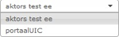

### 2.3 Role selection

Role selection is done in the top right corner of the portal using the selection
box. Information in the selection box is presented in the following format:

`<role name> (<active unit’s name>)` e.g. unit `school` has a regular users’
role `Regular user (school)`.

Example of role select:

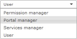

In this example active user has `Permission manager`, `Portal manager`,
`Services manager` and `User` rights.

### 2.4 Finishing work

Having finished your work, the  button has
to be clicked in order to end the current session and log out. It is recommended
to close the browser to ensure session is completely destroyed.

### 2.5 Help

To get help about current activity click the
 button. Current document is then displayed.

### 2.6 Error messages

#### 2.6.1 Error messages in forms

If there was a mistake in form filling, then field containing error will be
shown in red and you can see an error message by hovering over this field. For
example, when adding an invalid email the next error message is shown.

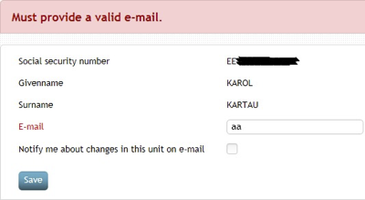

#### 2.6.2 General messages

General messages for user are shown on the first line of the page content.
Messages about successful actions are shown with green background, error
messages – with red background, and warning messages – with yellow.

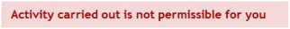

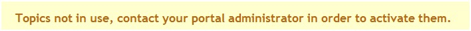

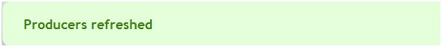

#### 2.6.3 Quick tips

There is a box with quick tips for user on the right part of every page of the
portal. They change depending on the menu choice. For example, for menu `My
settings` quick tip is shown like that:

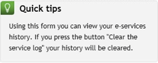

Tips are also shown when executing the service. These tips are added by the
portal managers.

## 3 Regular user

### 3.1 User settings

While being in regular user’s role, you can change your settings which are bound
to the active unit by using the `My settings` tab. There you can enter your
e-mail. In some portal types (all except Citizen Portal) you can set if you want
to be notified by an e-mail if your account has been changed. Changes to be
notified include user role additions/removals and group affiliation changes.

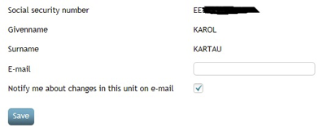

Change notification can be ordered only if a valid e-mail has been filled in,
otherwise the field will be disabled.

Example of the notification e-mail:

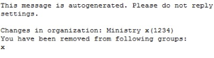

In the case of the Citizen Portal, the regular users do not have a user account,
therefore no notification about user account changes can be ordered. The rest of
the points mentioned in this paragraph apply on the Citizen Portal as well. Here
is a picture of the user settings form in Citizen Portal:

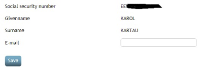

### 3.2 E-services

#### 3.2.1 Searching e-services

You can search e-services using the search field in the top right part of main
menu.

Having entered service name or part of it, corresponding services are displayed
as a list.

### 3.3 Using e-services in the portal

To use e-services in MISP2, please select a producer, whose services you wish to
use, from the producers list and click on its name. The way producers are sorted
depends on the configuration of the portal. In X-Road version 6 portals, a
subsystem code specifier may follow producer names in parenthesis.

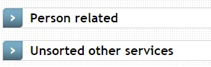

Then the system will display all open services from that specific producer

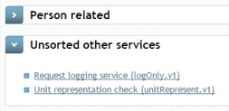

Below each producer section, the system displays a list of service links
referring to corresponding services, each of which consists of service
description followed by a technical identifier in parenthesis. The technical
identifier is composed of service technical name and version separated with a
dot.

Choose a service (by clicking on its row) from the list and the system will
display its input form (first sub form in the case of complex service). For
example:

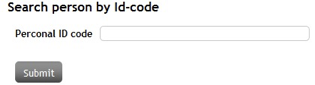

Enter the input data for the service and click on the button `Submit`. The
system will execute the service and display the output form

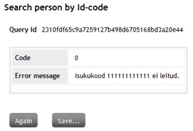

and saving options (click the `Save…` button).

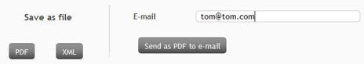

Text field `E-mail` - default value is the same as the one in user settings.

In case of complex service: depending on the complex service logic, the next
sub-form will be executed in the complex service according to user input.

### 3.4 Viewing service history

To view your service history select the tab `Service history`. The system will
display the service history filter with the following fields: `Between` and
`Service name`.

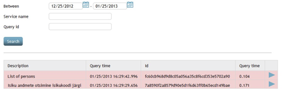

When the form is displayed, service history of the last month are automatically
searched and displayed in a table. `Query time` column shows query durations in
seconds.
